```{r setup, echo = FALSE}
library(DiagrammeR)
knitr::opts_chunk$set(eval = FALSE)
```

## Materials and Setup

* `r icon::fa("wifi")` Wifi connectivity
    - Network Name: Macquarie Events
    - Browse to [https://wifiportal.mq.edu.au](https://wifiportal.mq.edu.au) and follow to prompts and enter passcode: stats2019
* `r icon::fa("github")` Workshop Materials available at repo [github.com/jrwishart/SSA-Shiny-Workshop-2019](https://github.com/jrwishart/SSA-Shiny-Workshop-2019)
    - Clone within Rstudio (need `git` setup)
        - `Create New project` > `Version control` > `Git`
        - Set `https://github.com/jrwishart/SSA-Shiny-Workshop-2019` as the repo URL.
    - Clone from command line, navigate to parent directory of choice then,
        - `> git clone https://github.com/jrwishart/SSA-Shiny-Workshop-2019`
    - If git not installed.
        - `r icon::fa("file-archive")` Download the zip file from [here](https://github.com/jrwishart/SSA-Shiny-Workshop-2019/archive/master.zip) then extract it.
  

---

### Tenative Plan

* 9:00am Overview and basics
* 10:30am Morning tea
* 11:00am User interface
* 12:30pm Lunch
* 1:30pm Reactivity
* 3:00pm Break
* 3:30pm Intermediate / Advanced uses
* 5:00pm Close- Don’t forget to pick up your certificate!


---

# Overview

## What is a Shiny app?

* An `R` Package that creates interactive  web applications
* without needing to know HTML, CSS, or JavaScript
* Combines two things
    - Statistical Power of `R`
        + Use any analysis that can be coded in `R`.
    - Interactivity via web browser
        + Any modern web browser can work
        + __Reactive__ output expressions.

---

## What is reactive output?

* Output of program/interface reacts to user input
* Not a new concept at all
    - Easiest pervasive example of this is MS Excel!
* Shiny apps equivalent 

---

## How is this created?

* Shiny package: Written by RStudio team
  - Display Code: HTML and Javascript
  - Analysis Code: Regular R code
  - Almalgamation: Shiny provides R wrappers.

---

## Deployment of applet.

- Local deployment: Can run on any machine with R installed and a web browser. Syntax below
    - `> shiny::runApp(<path-to-my-app>)`
- Hosted on [shinyapps.io](shinyapps.io)
    - RStudio server built to host shiny apps (free and paid options).
- Server side deployment: 
    - Can host the app on a server running the Rstudio server software.

---

# RStudio Integrated Development Environment with Shiny

## Basic File Format of Applet.

* Two ways
    - Newer: Single file __app.R__
    - Older legacy way: Two Files
        - __server.R__ (Analysis code)
        - __ui.R__ (Display code)

---

## Locally running the app

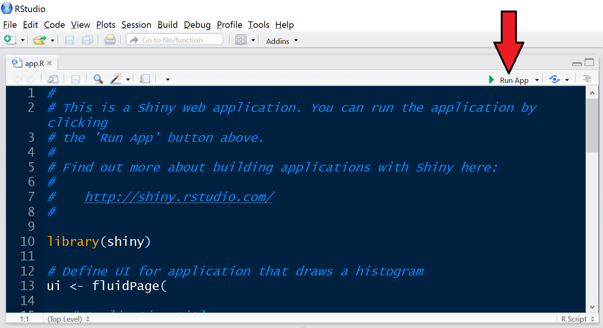

* Can run the app from the source window


---

## Three viewer options

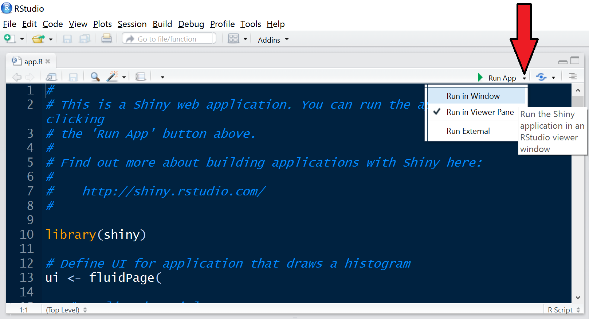

---

## Stop an app with the  button

* A running app uses the R console
    - Can't do any R commands
    - Why? Your R console is now the shiny server!


---

## Launch first app

* Create new app file

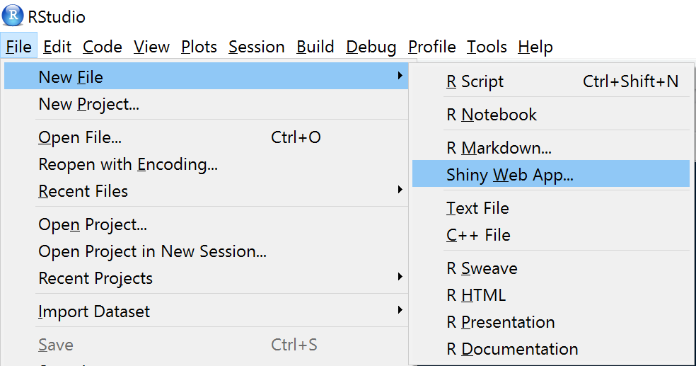


* Set name, directory location, and leave type as `app.R` 

* Then the different viewing options.
    - Run (or reload) 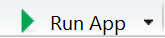
    - Stopping 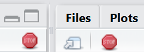
    - Window options 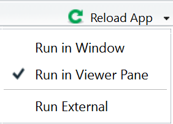

---

# Basics of an App

## Look at the app template

Open `apps/intro-01.R`

```{r}
library(shiny)

# Define UI 
ui <- fluidPage()

# Define server interactions
server <- function(input, output) {}

# Run the application 
shinyApp(ui = ui, server = server)
```

<div class="notes">
* Controls layout and appearance
    - user input area
    - output drawn
    - It really is HTML/CSS/Javascript
* Server needs code to 
    - deal with inputs 
    - create outputs
</div>

---

## Skeleton of standalone app file

```{r}
library(shiny)

# Define UI 
ui <- fluidPage()

# Define server interactions
server <- function(input, output) {}

# Run the application 
shinyApp(ui = ui, server = server)
```

* Four essential parts

---

## Skeleton of standalone app file

```{r}
library(shiny) #<<

# Define UI 
ui <- fluidPage()

# Define server interactions
server <- function(input, output) {}

# Run the application 
shinyApp(ui = ui, server = server)
```

* A call of the `shiny` library.

---

## Skeleton of standalone app file

```{r}
library(shiny)


# Define UI #<<
ui <- fluidPage() #<<

# Define server interactions
server <- function(input, output) {}

# Run the application 
shinyApp(ui = ui, server = server)
```

* A definition of the **u**ser **i**nterface (__ui__)
    - Inputs and where they are
    - Where the outputs should be
    - HTML/Javascript/CSS goes here

---

## Skeleton of standalone app file

```{r}
library(shiny)

# Define UI 
ui <- fluidPage()

# Define server interactions #<<
server <- function(input, output) {} #<<

# Run the application 
shinyApp(ui = ui, server = server)
```

* Server code instructions/recipe
    - How the server should create output from user input
    - When to **listen** for input changes (i.e. __reactive__)

---

## Skeleton of standalone app file

```{r}
library(shiny)

# Define UI 
ui <- fluidPage()

# Define server interactions
server <- function(input, output) {}

# Run the application  #<<
shinyApp(ui = ui, server = server) #<<
```

* A call to run the application.

---

# Place Output in App

## Two main families of functions

* `*Output` set that anchors the output in the UI
* `render*` set that tells Shiny how to make the output
* Segue: `R` is a sequential language
    - Classic `R`, each line is run sequentially.
    - Reactive language is not quite the same.
    - Shiny decides when to react.
    - When it reacts, it needs instructions to carry out!
    - You give Shiny instructions to do a set of tasks.
    - Shiny does the tasks, in the order it wants.

---

## render* and *Output Links

```{r diagrammeroutput, echo = FALSE, results = 'asis', eval = TRUE}
library(htmlTable)
# imgs <- paste0("')
renders[1] <- paste0("DT::", renders[1])
renderfuncts <- paste0(renders, "(expr,...)")
outputs <- c("dataTableOutput(outputId)", 
             "imageOutput(outputId,...)",
             "plotOutput(outputId,...)",
             "verbatimTextOutput(outputId)", 
             "tableOutput(outputId)",
             "textOutput(outputId, ...)",
             "uiOutput(outputId, ...)")
arrows <- rep("&#8660;", length(renders))
dat <- cbind(imgs, renderfuncts, arrows, outputs)

datnames = c("Visual Output", "render*", "", "*Output")
htmlTable(dat, header = datnames,
          align = "crcl", col.rgroup = c("none", "#F7F7F7"), col.columns = "none")
```

---

## Example: put *Output call in UI.

```{r}
library(shiny)


ui <- fluidPage( #<<
        plotOutput("myShinyPlot") #<<
) #<<

server <- function(input, output) {}

shinyApp(ui = ui, server = server)
```

* `*Output(<outputId>)` call goes in the UI area
    - e.g. `plotOutput("myShinyPlot")` shown above

---

## Example: Linking it to server render

```{r}
ui <- fluidPage(
        plotOutput("myShinyPlot")
)

server <- function(input, output) {
  output$myShinyPlot <- renderPlot({ #<<
    hist(faithful[, 1]) #<<
  }) #<<
}

shinyApp(ui = ui, server = server)
```

* `output$<outputId> <- render*(<output code>)` in server area
    - This is a boring plot that isn't interactive!
    - Need a statement with `input$<inputId>` to make it __reactive__!

---

# Allow Modifiable Inputs

## Basic Inputs (from [RStudio cheatsheet](https://www.rstudio.org/links/shiny_cheat_sheet/))

```{r echo = FALSE, results = "asis", eval = TRUE}
library(htmlTable)
# imgs <- paste0("')
dat <- cbind(imgs[1:7], calls[1:7], c(imgs[8:13], ""), c(calls[8:13], ""))

datnames = rep("", 4)
htmlTable(dat, header = datnames,
          align = "llll", col.rgroup = c("none", "#F7F7F7"), col.columns = "none")
```

<!-- {.columns-2 .smaller} -->

<!-- * 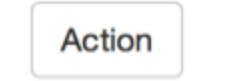__actionButton__(inputId, label) -->
<!-- * __actionLink__(inputId, label) -->
<!-- * __checkboxGroupInput__(inputId, label, choices) -->
<!-- * 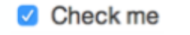__checkboxInput__(inputId, label) -->
<!-- * 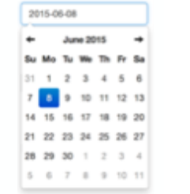__dateInput__(inputId, label) -->
<!-- * 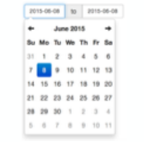__dateRangeInput__(inputId, label) -->
<!-- * 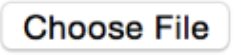__fileInput__(inputId, label) -->
<!-- * 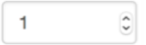__numericInput__(inputId, label, value) -->
<!-- * 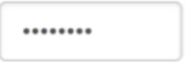__passwordInput__(inputId, label) -->
<!-- * 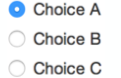__radioButtons__(inputId, label, choices) -->
<!-- * 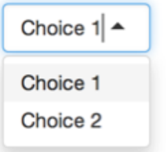__selectInput__(inputId, label, choices) -->
<!-- * 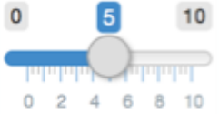__sliderInput__(inputId, label, min, max) -->
<!-- value -->
<!-- * 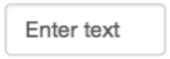__textInput__(inputId, label) -->

---

## Skeleton Input structure

```{r}
ui <- fluidPage(
    selectInput(inputId = "myInput",...), #<<
    plotOutput(outputId = "myOutput")
)

server <- function(input, output) {
  output$myOutput <- renderPlot({
    plot(x = input$myInput)
  })
}
```

* `input` is an R environment
    - `*Input` put in the UI area
    - objects accessed/references with `input$<inputId>`
    - `<inputId>` is a character string label of your choice
    - __All__* inputs require an `<inputId>`
        - Only the old `submitButton` doesn't need an `<inputId>`

---

## Input structure

```{r}
ui <- fluidPage(
    someInput(inputId = "myInput",...),
    someOutput(outputId = "myOutput") #<<
)

server <- function(input, output) { #<<
  output$myOutput <- renderPlot({ #<<
    plot(x = input$myInput) #<<
  }) #<<
} #<<
```

* The Output is placed in the UI with one of the `*Output` functions
* Server code written which depends on the `input$<inputId>`
    - Can be in the `render*` function
    - Can be in a __reactive__ object (more on this later)

---

## Example: Choosing the dataset.

Open `apps/intro-02.R`

```{r}
ui <- fluidPage(
  selectInput(inputId = "datachoice", #<<
              label = "Choose dataset to view:", #<<
              choices = c("eruptions", "waiting"), #<<
              selected = "eruptions"), #<<
  plotOutput("myShinyOutput")
)
```

---

### Exercise : Add another input to the basic faithful histogram app

* Add a slider to control the number of bins with the following arguments
    - __inputId = "numBins"__
    - __label = "Select number of bins"__
    - __min = 1__ 
    - __max = 50__
    - __value = 30__
* Use this input variable to control the number of bins as an argument in the __geom_histogram__ function. (see `? geom_histogram`, the bins argument)
* Run the app and see the result
* The solution will be shown in `apps/intro-03.R`

---

### Exercise: Show numeric output

* Add a checkbox input to show a data `summary` of the selected dataset
  - Use the __checkBoxInput(inputId, label)__ function
* Allocate space in the UI with __verbatimTextOutput`__
* Link the output to the server using __renderPrint__

---

* The solution is shown in `apps/intro-04.R`

---

# Outsourced Hosting: Shinyapps.io


---

## Shinyapps.io: What is it?

* Rstudio maintains a server 
    - Pros: As promoted
        - Easy to use
        - Secure
        - Scalable
    - Cons
        - Only basic free options
* Alternatives
    - Build your own server.
    - Create your own with Amazon Web Services.
    - Stick with local hosting.

