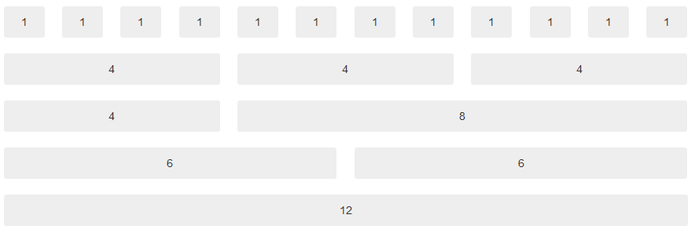
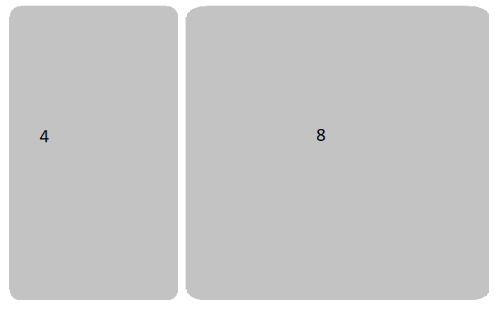
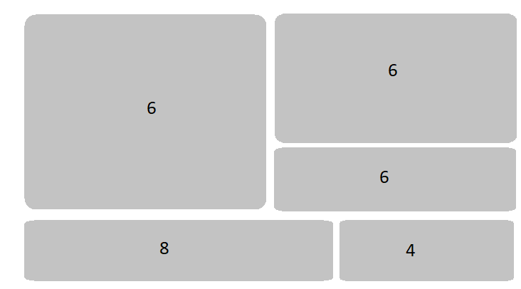
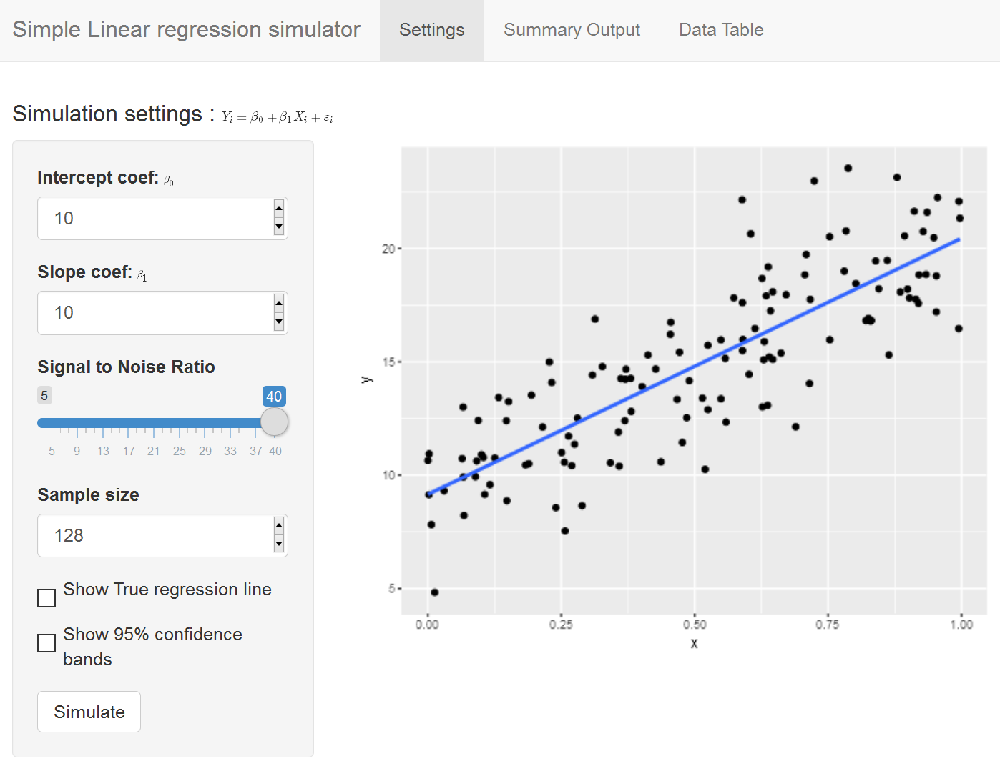

```{r setup, echo = FALSE}
library(DiagrammeR)
knitr::opts_chunk$set(eval = FALSE)
```

## What is the User Interface?

### User Interface languages

* The User interface is really HTML with CSS and Javascript
    - __NB__: A Shiny app author doesn't need to know this!
* A keen author skilled in HTML/CSS/Javascript can write more complex advanced apps. 
    - See (Insert links)

---

### UI building options

1. Use the built-in layouts and inputs/outputs
    - __We will focus on this__
2. Use external packages __honorable mention this workshop__
    - Can create dashboards (shinydashboard, flexdashboard)
    - Can choose from set of themes (shinythemes)
3. Advanced Users who know some HTML, CSS, and/or Javascript __beyond our scope__
    - Use tag objects
    - Write own UI functions
    - Write Custom inputs/outputs
    - Create own HTML templates
    - Use existing CSS/Javascript libraries/frameworks.

---

### Possible built-in frameworks

* Bootstrap grid framework
    - `fluidPage`, `fixedPage`, `fluidRow`, `column`
* Navigation Panels
    - `tabsetPanel`, `navlistPanel`, `navbarPage`
* Containers
    - `wellPanel`, `absolutePanel`, `fixedPanel`
* Fill layouts
    - `fillPage`, `fillRow`, `fillCol`
* Modals and notifications
    - `showModal`, `modalDialog`

---

## Bootstrap 2 Grid

Bootstrap 2.0 is a grid system for building layouts of all shapes and sizes. It's based on a 12 column layout.

-- Created by Mark Otto and Jacob Thornton at Twitter

---

### Bootstrap 2.0 Grid



* Each webpage has 12 columns.
* Each column of content must span integer number of subcolumns

---

### General Layout Commands

* Layout setup with
    - `fluidPage()` creates the entire bootstrap grid page
* Sidebar layout setup and controlled with
    - `sidebarLayout()`: setups the layout
    - `sidebarPanel(input)`: Sidebar (inputs) to be placed
    - `mainPanel(output)`: main Panel to be placed
* General layout controlled with
    - `fluidRow()` wraps each row's column
    - `column(width, )` wraps each column's content

---

### sidebarLayout



---

### sidebarLayout

* __sidebarLayout(sidebarPanel(), mainPanel(),...)__
    - __sidebarPanel__: 
        - Takes up 1/3 of the column space
        - Contains the input controls 
    - __mainPanel__:
        - Takes up 2/3 of the column space
        - Contains the output

---

### Skeleton of sidebarLayout

```{r eval = FALSE}
library(shiny)

ui <- fluidPage(
  sidebarLayout(
    sidebarPanel(
      *Input(<inputId>)
    ),
    mainPanel(
      *Output(<outputId>)
    )
  )
)

server <- function(input, output) { <my-shiny-recipe> }

shinyApp(ui = ui, server = server)
```

* Careful with the commas!

---

### Example: Cleaning up the intro

Open `apps/ui-01.R`

* Notice the `titlePanel` before the `sidebarLayout`.
    - Adds a title in larger font to the App.
* Resize the app window and see what happens.
* `sidebarLayout` also can be flipped. Change
    - `sidebarLayout(position = "left",` to
    - `sidebarLayout(position = "right",`


---

### General Bootstrap Layout


* Each of the columns __must__ span an __integer__ width
* Height is responsively determined by Javascript
    - Further details, at [Rstudio grid layout guide](https://shiny.rstudio.com/articles/layout-guide.html)

---

### Example code of rows 3 & 4

```{r , eval = FALSE, echo = TRUE}
UI <- fluidPage(
  fluidRow(
    column(4, object1),
    column(8, object2)
  ),
  fluidRow(
    column(6, object3),
    column(6, object4)
  )
)
```

---

### More detailed example:



---

### Bootstrap code for last example

```{r eval = FALSE}
ui <- fluidPage(
  fluidRow(
    column(6, object1),
    column(6, object2, object3)
  ),
  fluidRow(
    column(8, object4),
    column(4, object5)
  )
)
```

---

### Exercise using Bootstrap

Open `apps/ui-02.R`

* Modify the layout to look like the next slide
* Suggest viewing in external browser if you want the typeset equations.

---

### Goal Layout


---

### Solution

Open `apps/sol-ui-02.R`

---

### Navbar Pages


* App can be split into tabs.
* Uses the bootstrap navbar setup
    - Can embed other bootstrap code inside each tab (fluidRow, column)

---

### Skeleton of Navbar

.pull-left[
```{r eval = FALSE}
ui <- navbarPage(title = "My Application",
  tabPanel("My Tab 1",
    *Input("input1")
    *Output("output1")
  ),
  tabPanel("Component 2",
    ...
  ),
  tabPanel("Component 3",
    ...
  )
)
```

* Can place (nest) other UI layouts in each `tabPanel`]

.pull-right[


]

---

### Exercise using Navbar

Open `apps/ui-03.R`. Modify the UI to have three `tabPanels`

* __Simulation settings__: All the simulation inputs and scatterplot go here
* __Summary Ouptut__: Place the summary lm output here
* __Data Table__: Place the dataTable output here.

Don't forget to set the ui to be `ui <- navbarPage(`

---

### Goal Layout


---

### Solution

Open `apps/sol-ui-03.R`

---

## External packages

### Possible external packages

* Shiny Dashboard in package `shinydashboard`
* Shiny Themes in package `shinythemes`
* Markdown style! in package  `flexdashboard`
* miniUI in package (see rstudio github)
* More ... 

---

### Shiny themes

* Easy way to change the look and colour scheme using Bootstrap themes
* See examples at [Rstudio](https://rstudio.github.io/shinythemes/)

---

### How to use Shiny Themes

* Load the `shinythemes` package in the preamble of your `app.R`
* Two possible ways
    - Set the theme using the `theme` argument in UI
    - Use the theme selector
    
### Set desired theme

```{r eval = FALSE}
library(shinythemes)

ui <- fluidPage(theme = shinytheme("cerulean"),
  ...
)
```

* Also works inside `bootstrapPage`, `navbarPage`, or `fixedPage`

---

### Live Theme selector

```{r eval = FALSE}
ui <- fluidPage(
        shinythemes::themeSelector()
        ...
      )
```

* Somewhere in your ui call, place the code above
* Places a `selectInput` box to dynamically choose a theme.

---

### Exercise on shiny themes

Open your favourite app so far in `apps/` and customise the theme using the live themeselector

* When you have chosen a theme. 
    - Stop the app
    - Go back and set the theme (`theme = "<mychoice>"`).
